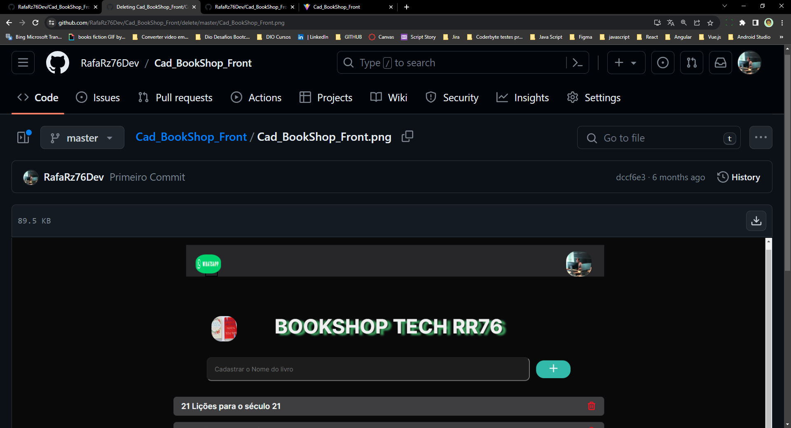

# Olá 

---

#  Venho aqui apresentar 

# <div align="center"> PROJECT-REGISTER-BOOKS

<br>

## <div align="center">[Clique aqui para acessar o Projeto](https://rafarz76dev-cadbookshop-react.netlify.app/)

<div align="center">

 </div>

---

##  Continuação do Projeto executado em Front End com as tecnologias:
- [ReactJS](https://reactjs.org/)
- Vite
- CSS
- Styled Components

Conceitos:

- Props
- Component
- Modules
- Framework Structure
- Hooks
- State

---

## :computer: No terminal:

````bash
  # creation of the project
  npm create vite @latest

  # clone repository
  git clone

  # enter web folder
  cd project-name

  # download dependencies
  yarn install

  # running web project
  yarn run dev
  👉 Vai abrir
   para visualizá-lo em seu navegador ```http://127.0.0.1:5173/```

  # imported the following dependencies and libraries
  npm install --save phosphor-react
  npm install --save styled-components
````

---

##  Social:

&nbsp;Connect with me @RafaRz76Dev :wink:
<br />

- [LinkedIn](https://www.linkedin.com/in/rafael-raizer/)
- [Whatsapp](https://api.whatsapp.com/send/?phone=47999327137)
- [Telegram](https://t.me/RafaRaizer76)
- [Gmail](mailto:rafaelraizer76@gmail.com)

<br />

### ▶ 😀👀 Bora lá....

### Gostou, então já deixa a 🌟

<br />

---

[react]: https://pt-br.reactjs.org/docs/getting-started.html
[hooks/states]: https://reactjs.org/docs/hooks-state.html
[props]: https://pt-br.reactjs.org/docs/components-and-props.html
